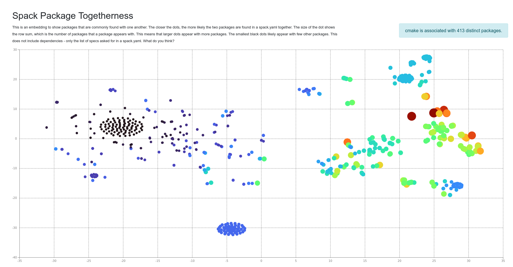

# Spack Stack Catalog


This is the spack stack community catalog, or spack.yaml files discovered
in the wild across the community! It is inspired by the [snakemake-workflow-catalog](https://github.com/snakemake/snakemake-workflow-catalog)
that is released under an [MIT LICENSE](.github/SNAKEMAKE-LICENSE).

⭐ [View the Catalog](https://spack.github.io/spack-stack-catalog/) ⭐

**this repository is still under development!**

## Usage

### Install Dependencies

The update of repositories that have spack.yaml is done during an automated CI,
however you might want to run the update script locally. You can first install
requirments:

```bash
python -m venv env
pip install -r requirements.txt
```

and spack should also be on your path.

```bash
which spack
```

### Environment

You'll need to export a personal access token as `GITHUB_TOKEN`:

```bash
export GITHUB_TOKEN=xxxxxxxxxxx
```

### Run update script

Then, run the script!

```bash
python scripts/generate-catalog.py
```

This should be run nightly to update the stacks here.

### Generate graph

The script [generate-graph-data.py](scripts/generate-graph-data.py) will parse
the current set of spack.yaml files and count the number of times packages are
installed with one another, not accounting for versions. We then create
a similarity matrix based on the counts, and visualize that. More specifically:

1. Make a matrix that counts "similarity" between packages. The similarity is based e.g., on the number of times packages that appear together. We don't need to worry about the diagonal (e.g., leave it as NaN).
2. We need to normalize by packages that appear across a lot of packages. So we want to divide by the square root of the row sums and the columns sums. We do this so it's still symmetric, and we use a square root because we want the units to go away.
3. Transform the counts to a distance e.g., [using one of these functions](https://stackoverflow.com/questions/4064630/how-do-i-convert-between-a-measure-of-similarity-and-a-measure-of-difference-di). TLDR - we do distance = 1/ our normalized count matrix.
4. Finally, use dimensionality reduction to find coordinates for each package. Packages that appear frequently together will be closer. E.g., [isomap](https://scikit-learn.org/stable/modules/generated/sklearn.manifold.Isomap.html) or [TSNE](https://scikit-learn.org/stable/modules/generated/sklearn.manifold.TSNE.html).

[](https://spack.github.io/spack-stack/catalog/similarity/)

The embedding [on the catalog](https://spack.github.io/spack-stack/catalog/similarity/) shows packages that are commonly found with one another. The closer the dots, the more likely the two packages are found in a spack.yaml together. The size of the dot shows the number of distinct packages that a package appears with. This means that larger dots appear with more packages. The smallest black dots likely appear with few other packages. This does not include dependencies - only the list of specs asked for in a spack.yaml.

## License

Spack is distributed under the terms of both the MIT license and the
Apache License (Version 2.0). Users may choose either license, at their
option.

All new contributions must be made under both the MIT and Apache-2.0
licenses.

See [LICENSE-MIT](https://github.com/spack/spack/blob/develop/LICENSE-MIT),
[LICENSE-APACHE](https://github.com/spack/spack/blob/develop/LICENSE-APACHE),
[COPYRIGHT](https://github.com/spack/spack/blob/develop/COPYRIGHT), and
[NOTICE](https://github.com/spack/spack/blob/develop/NOTICE) for details.

SPDX-License-Identifier: (Apache-2.0 OR MIT)

LLNL-CODE-811652
